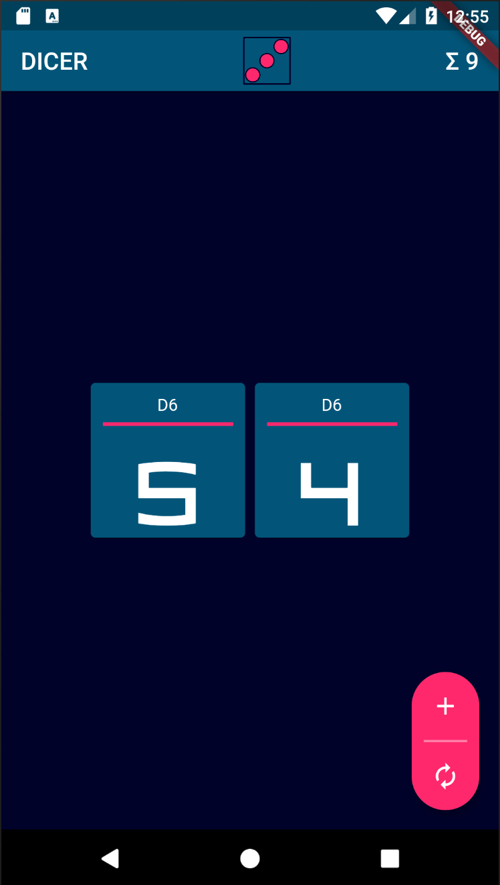
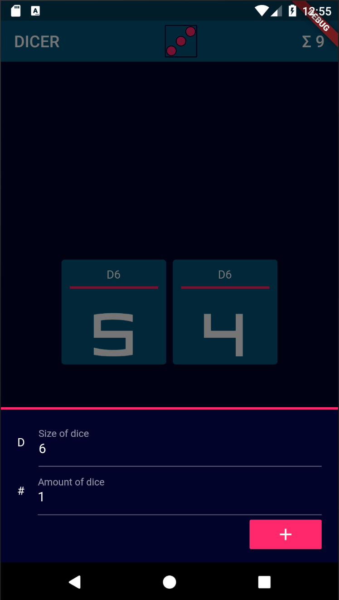
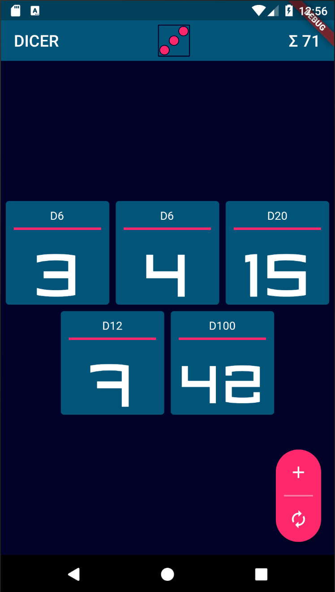

A simple app to roll dices.

Made with Flutter using Provider state management.

  
  
  

## Running

First, install flutter than run `flutter doctor` and fix possible errors.
To run the app simply run `flutter run`.

## References

- [Flutter Online Documentation](https://flutter.dev/docs)
- [Lab: Write your first Flutter app](https://flutter.dev/docs/get-started/codelab)
- [Flutter simple app state management](https://flutter.dev/docs/development/data-and-backend/state-mgmt/simple)
- [Pragmatic State Management in Flutter](https://www.youtube.com/watch?v=d_m5csmrf7I)
- [WidgetView Pattern](https://blog.gskinner.com/archives/2020/02/flutter-widgetview-a-simple-separation-of-layout-and-logic.html)
- [Unit Testing](https://flutter.dev/docs/cookbook/testing/unit/introduction)
- [Integration Testing](https://flutter.dev/docs/cookbook/testing/integration/introduction)
- [Bottom App Bar](https://proandroiddev.com/flutter-how-to-using-bottomappbar-75d53426f5af)
- [Slivers for fancy scrolling](https://flutter.dev/docs/development/ui/advanced/slivers)
- [Prepare to release](https://flutter.dev/docs/deployment/android)
- [Floating App Bar with Slivers](https://flutter.dev/docs/cookbook/lists/floating-app-bar)
